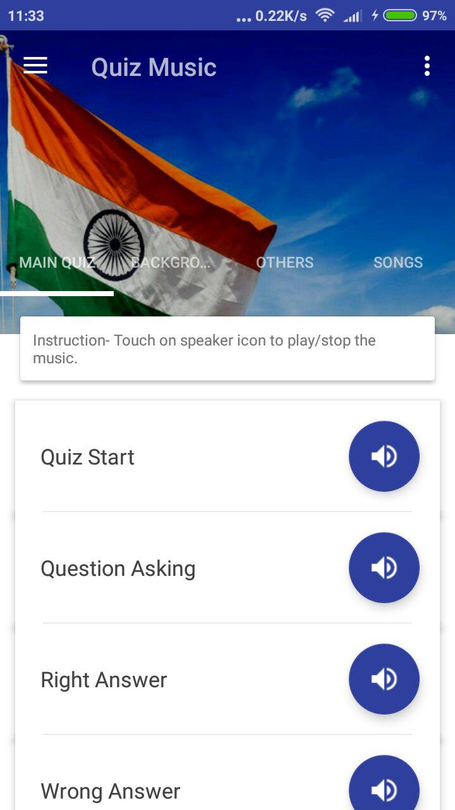
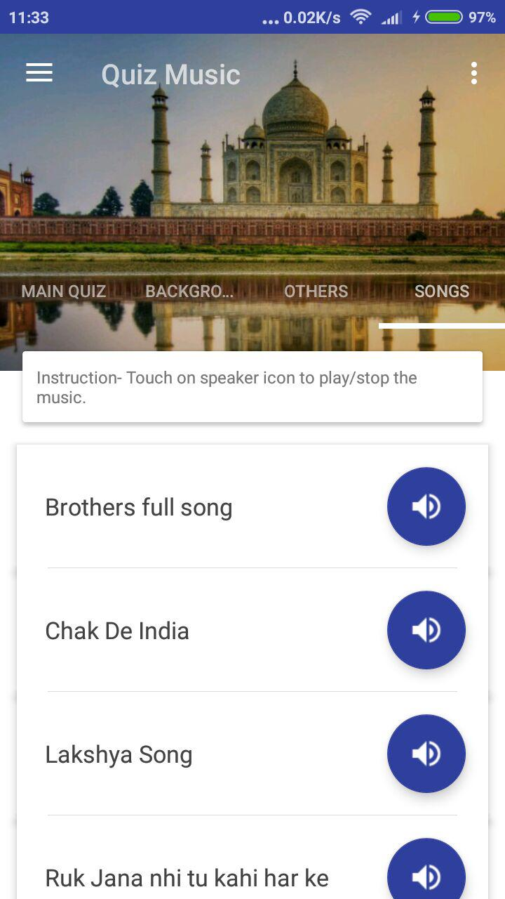

# QuizMusic

QuizMusic comes with pre-bundled music which you can use to give a music background in your quiz, just like in KBC.

 

## Install

## Contributing

Please read [CONTRIBUTING.md](https://github.com/andy1729/FuelFriend/blob/master/CONTRIBUTING.md) for details on code of conduct, and the process for submitting pull requests.

## Author

* **Ujjawal Anand** - [*andy1729*](https://andy1729.github.io)
[*twitter*](https://twitter.com/ujjawal1729)

## License

This project is licensed under the MIT License - see the [LICENSE.md](LICENSE.md) file for details
